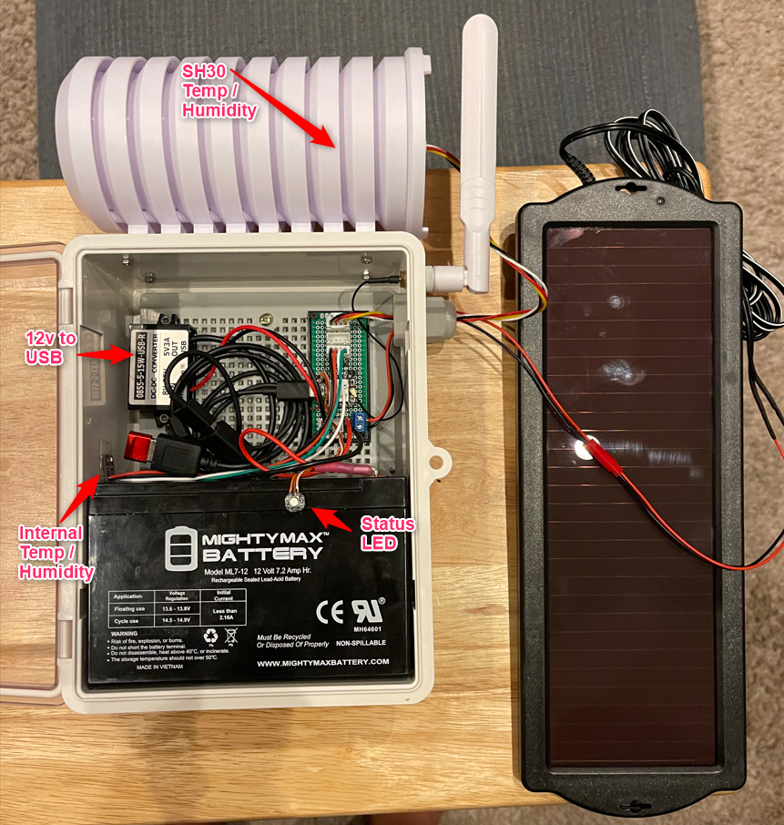

# Garden Sensor
Weather station like sensor stack driven by esphome and home assistant.  The goal of this project is to get a decent temperature and humidity sensor outside for the various inside devices that use 'outside' temperature.

This sensor is battery powered by a 12v gel cell battery that is mounted in a water proof enclosure.  The battery is charged by a solar panel that was manufactured as a car battery charger and maintainer so no need for additional solar charge circuit.

# Future Upgrades

The plan at some point is to add a RG-15 solid state rain sensor as well as a soil moisture probe and so there are additional connectors mounted to the pcb to support this future state.
